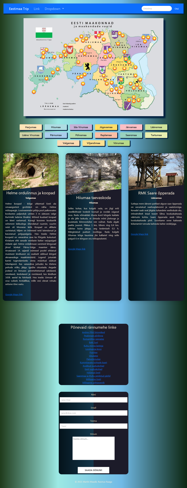

<p align="center"></p>

<h1 align="center">
    <strong>Eesti reisijuht</strong>
</h1>
<h3 align="center">
    Põnevaid paiku mida Eestis avastada
</h3>


## Lehelt võib leida
* *Kaarti, mille huvipunktidele hiirega liikudes kuvatakse punkit nimi*
* *Maakonnanupud millel klikkides kuvatakse vastava maakonna huvipunktid infokaartidena nuppude alla*
* *Pealehel kuvatakse kolm juhuslikku huvipunkti andmebaasist*
* *Infokaartid sisaldavad ühde pilti, punkti nime, maakonna nime, lühitutvustust, ja google maps linki*
* *Võimalus kuvada ka google kaart iga infotahvli alla - hetkel välja kommenteeritud*
```
/* echo$row['iframe']; */			// google kaart
```
* *Välislingid põnevatele Eestimaad tutvustavatele lehtedele*
* *Kontaktivorm*


## Kasutatud vahendid
* *HTML*
* *CSS*
* *Bootstrap*
* *JavaScript*
* *PHP*
* *SQL*
